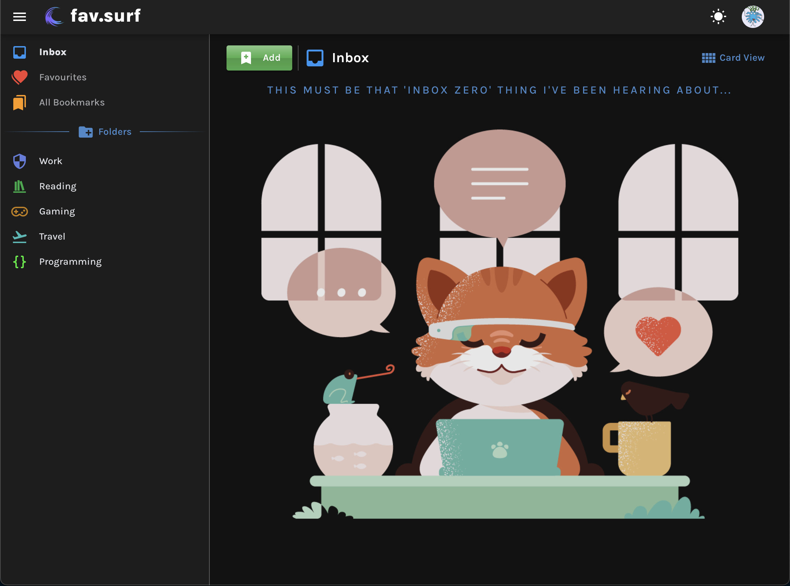

# fav.surf

A massively under contruction self-hosted bookmark management tool. Built using [Quasar v2](https://quasar.dev/) (Vue 3) and [supabase](https://supabase.io).

## Screenshots

## Features

- User login/register
- Light/dark mode toggle
- Manage folders, select icons (mdi v5) with custom colours
  - Reordering folders and nested folders coming soon™️
- You can't really add bookmarks yet I'm still playing around with how I want it to work

## Contributing

Things are messy at the moment but feel free to reach out if you want to contribute. I'll add more here once things are tidied up.
